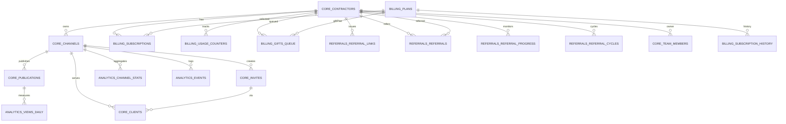

# Структура базы данных SmetaBot

Документ фиксирует целевую модель данных для “чистого” развёртывания. База создаётся заново — унаследованные таблицы (`data.db`, старые миграции `0001/0002`) не используются.

---

## 1. Цели и допущения

- централизуем хранение в PostgreSQL, без SQLite;
- разделяем функциональные области по схемам (`core`, `billing`, `analytics`, `referrals`, `admin`);
- готовим основу для подписок, реферальной программы, статистики, административных операций;
- предполагаемый масштаб: 1–5 тыс. подрядчиков; индексы и ограничения рассчитаны на этот уровень.

---

## 2. Области ответственности

| Схема       | Назначение                                                   | Основные таблицы/представления                                         |
|-------------|--------------------------------------------------------------|------------------------------------------------------------------------|
| `core`      | Подрядчики, каналы, публикации, инвайты, клиенты             | `contractors`, `channels`, `publications`, `invites`, `clients`, `team_members` |
| `billing`   | Подписки, лимиты, подарочные периоды                         | `plans`, `subscriptions`, `subscription_history`, `usage_counters`, `gifts_queue` |
| `analytics` | Метрики и отчёты для UI                                      | `views_daily`, `channel_stats`, `events`, представления `profile_overview`, `profile_referral_progress` |
| `referrals` | Реферальная программа                                        | `referral_links`, `referrals`, `referral_progress`, `referral_cycles` |
| `admin`     | Пользователи админ-бота и журнал действий                    | `admin_users`, `admin_actions`                                         |

---

## 3. Детализация таблиц и ограничения

Ниже описаны ключевые таблицы и выбранные ограничения. Для статусов и перечислений используем `CHECK`-ограничения (ENUM можно добавить позднее, если потребуется централизованное расширение).

### 3.1. `core`

- **contractors** – учёт подрядчиков.
  - Поля: `id` (PK), `tg_user_id` (уникален), `username`, `full_name`, `status`, `created_at`.
  - `status` — `CHECK (status IN ('active','blocked'))`.

- **channels** – Telegram-каналы подрядчика.
  - FK `contractor_id` → `core.contractors(id)` (ON DELETE CASCADE).
  - Атрибуты: `tg_chat_id` (уникален), `title`, `username`, флаги `created_by_bot`, `synced`, `last_synced_at`.
  - Индекс: `idx_channels_contractor`.

- **publications** – сообщения с файлами.
  - FK `channel_id` → `core.channels(id)`, `message_id` (уник. в рамках канала), `file_name`, `file_type`, `views`, `posted_at`, `deleted`.
  - Индекс: `idx_publications_channel_posted`.

- **invites** – инвайты в канал.
  - FK `channel_id`, поля `token`, `expires_at`, `max_uses`, `used_count`, `editable`, `created_at`.
  - Индекс: `idx_invites_channel`.

- **clients** – клиенты, вошедшие по инвайту.
  - FK `channel_id`, `invite_id`, `tg_user_id`, `username`, `full_name`, `joined_at`, `blocked`.
  - Индексы: `idx_clients_channel`, `idx_clients_invite`.

- **team_members** – члены команды (тариф Business).
  - FK `owner_contractor_id`, `member_contractor_id` → `core.contractors(id)` (CASCADE).
  - Уникальность `(owner_contractor_id, member_contractor_id)`.

### 3.2. `billing`

- **plans** – тарифы.
  - Поля: `code` (`FREE|PRO|BUSINESS`), `name`, `price_month`, `features` (JSONB), `channels_limit_one_off`.
  - `features` пример: `{"can_edit_channel": true, "can_sync": true, "team_size": 4, "crm": false}`.

- **subscriptions** – активная подписка подрядчика.
  - FK `contractor_id` (UNIQUE) и `plan_id`.
  - `status` (`active|trial|grace|expired|cancelled`), `source` (`paid|gift|trial|admin_grant`), `starts_at`, `expires_at`.
  - `CHECK` для полей `status` и `source`.

- **subscription_history** – история подписок.
  - Повторяет ключевые поля + `created_at`.

- **usage_counters** – счётчики лимитов.
  - PK `contractor_id`, поля `channels_created_total`, `last_channel_created_at`.

- **gifts_queue** – очередь подарков.
  - `contractor_id`, `plan_id`, `days`, `reason` (`referral_reward|admin_grant`), `queued_at`, `applied_at`.
  - Поведение: отдельный обработчик (cron) раз в день проверяет записи с `applied_at IS NULL`. Если активной PRO/BUSINESS подписки нет — применяет подарок, проставляя `applied_at = now()`. Иначе запись остаётся в очереди.

### 3.3. `analytics`

- **views_daily** – просмотры по публикациям и датам (PK `(publication_id, collected_at)`).
- **channel_stats** – агрегаты по каналу (`files_count`, `views_total`, `clients_total`, `blocked_total`, `last_updated`).
- **events** – события: `event_type` (`client_join`, `client_leave`, `invite_used`, `file_posted`, `file_deleted`, `sync_run`), `details` (JSONB произвольной структуры), `created_at`.
- **Представления**:
  - `profile_overview` – “Мой профиль”: текущий план, лимиты, статистика каналов, активные инвайты, очередь подарков. При росте данных можно преобразовать в `MATERIALIZED VIEW` и выполнять `REFRESH` по расписанию.
  - `profile_referral_progress` – прогресс реферальной программы.

### 3.4. `referrals`

- **referral_links** – уникальные токены приглашения (`contractor_id`, `token`, `created_at`).
- **referrals** – связь “кто кого привёл” (уникальность `(referrer_id, referred_contractor_id)`).
- **referral_progress** – выполнено ли условие (≥2 каналов) для конкретного реферала.
- **referral_cycles** – циклы по 3 квалифицированным приглашениям: `cycle_no`, `qualified_refs_required`, `qualified_refs_done`, `state` (`in_progress|completed|reward_queued`), `created_at`, `completed_at`.

### 3.5. `admin`

- **admin_users** – пользователи админ-бота: `id`, `tg_user_id` (уникален), `username`, `role` (`support|manager|owner`), `is_active`, `added_at`.
- **admin_actions** – журнал действий администраторов: `admin_id` FK → `admin_users`, `action`, `target_type`, `target_id`, `payload` (JSONB с деталями), `created_at`.

---

## 4. Ограничения и индексы

- Все FK настроены с осмысленными `ON DELETE` (в основном `CASCADE`).
- Статусы и перечисления защищены `CHECK`-ограничениями (см. таблицы выше).
- Основные индексы: `idx_channels_contractor`, `idx_publications_channel_posted`, `idx_invites_channel`, `idx_clients_channel`, `idx_clients_invite`. При необходимости можно добавить составные индексы под аналитику (например, `views_daily` по `collected_at`).

---

## 5. ER-диаграмма (алиасы без точек)

> Aliases используются только для визуализации. 
> `CORE_CONTRACTORS` → `core.contractors`, `BILLING_PLANS` → `billing.plans`, и т.д.

Диаграмма служит для согласования и не показывает технические поля (`created_at`, `updated_at` и т.п.).

---

## 6. Переход со старой схемы (0002)

Если потребуется миграция данных, соответствие следующее:

- `projects` / `channels` → `core.contractors` + `core.channels` (проект = канал конкретного подрядчика).
- `documents` / `messages` → `core.publications` и `analytics.views_daily`.
- `invites` → `core.invites` (пара `channel_id`, `token`).
- `profiles` (аватарки) – можно перенести в отдельную таблицу `core.profile_avatars` (пока не включена и обсуждается отдельно).
- `channel_files` → `core.publications` (с привязкой к `channel_id` и `message_id`).

---

## 7. Следующие шаги

1. Подготовить начальную миграцию `0001_init.sql`: удалить остатки старых схем, создать новые таблицы/представления, заполнить `billing.plans` (FREE / PRO / BUSINESS).
2. Реализовать сервисы в `bot/services` под новую структуру (`core`, `billing`, `analytics`, `referrals`, `admin`).
3. Переписать бота и воркеры на работу с PostgreSQL (без `aiosqlite`), синхронизировать воркеры для заполнения `analytics`/`billing`/`referrals`.
4. Настроить обработчик подарков (`gifts_queue`) и отчётность (cron/periodic tasks).
5. При росте объёма данных рассмотреть перевод `analytics.profile_overview` в `MATERIALIZED VIEW` с периодическим `REFRESH`.
6. Расширить схему `admin`, если потребуется больше сущностей (например, токены, права доступа). Выпуск таких изменений вносится отдельными миграциями после согласования.
