# 📊 SmetaBot — Схемы проекта и сценарии

## 📑 Содержание

1. [Архитектура системы](#1-архитектура-системы)
2. [Схема авторизации через QR-код](#2-схема-авторизации-через-qr-код)
3. [Сценарий: Первый запуск подрядчика](#3-сценарий-первый-запуск-подрядчика)
4. [Сценарий: Создание канала](#4-сценарий-создание-канала)
5. [Сценарий: Публикация документа](#5-сценарий-публикация-документа)
6. [Сценарий: Клиент получает доступ](#6-сценарий-клиент-получает-доступ)
7. [Поток данных: Обработка документа](#7-поток-данных-обработка-документа)
8. [Схема базы данных](#8-схема-базы-данных)
9. [Инфраструктура развёртывания](#9-инфраструктура-развёртывания)
10. [Схема взаимодействия компонентов](#10-схема-взаимодействия-компонентов)

---

## 1. Архитектура системы

### 1.1. Общая архитектура

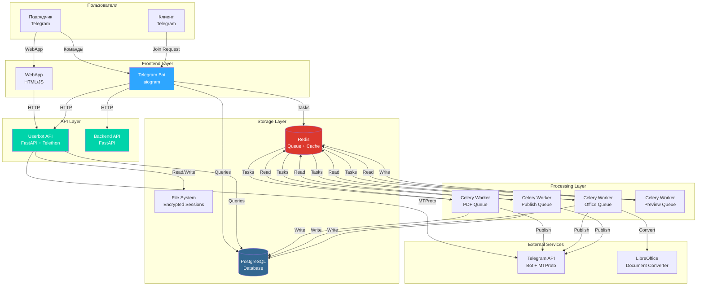

### 1.2. Компоненты и их взаимодействие

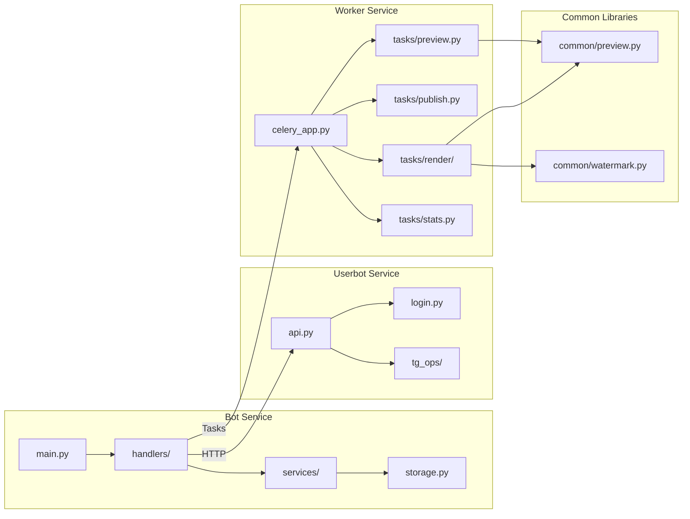

---

## 2. Схема авторизации через QR-код

### 2.1. Процесс авторизации

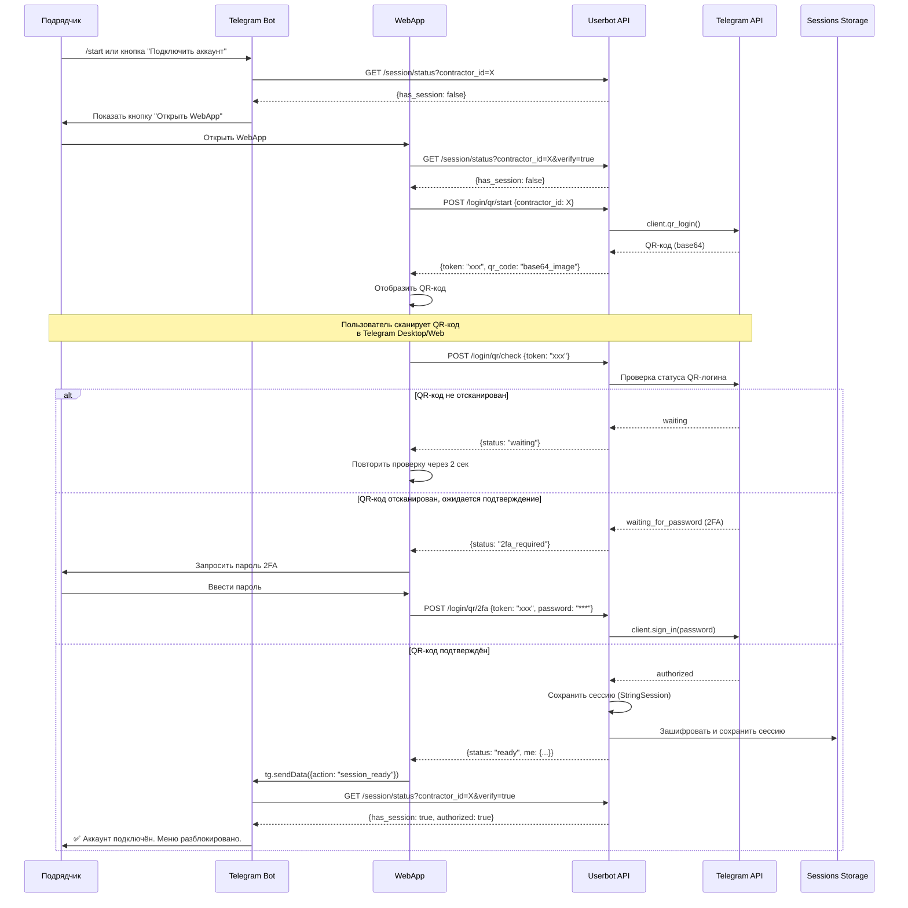

### 2.2. Схема WebApp для QR-авторизации

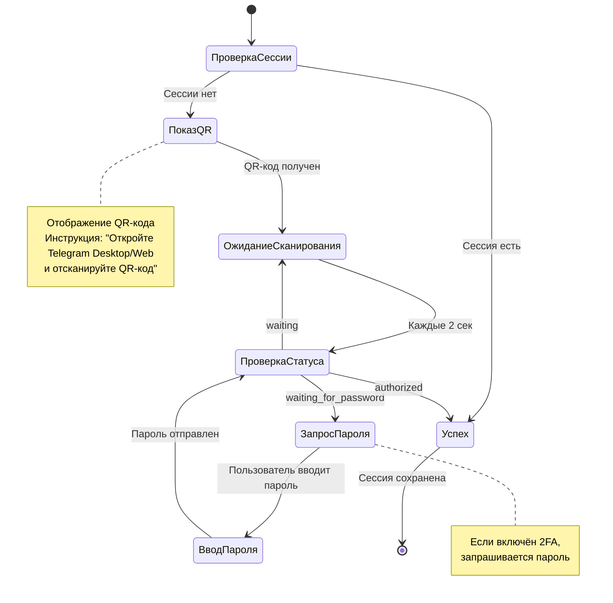

### 2.3. API эндпоинты для QR-авторизации

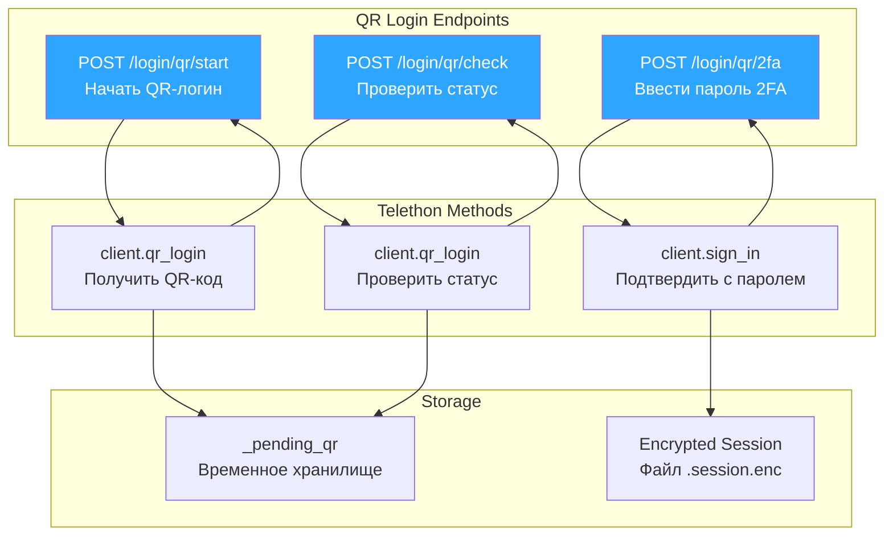

---

## 3. Сценарий: Первый запуск подрядчика

### 3.1. Диаграмма последовательности

```mermaid
sequenceDiagram
    participant U as Подрядчик
    participant B as Telegram Bot
    participant W as WebApp
    participant UA as Userbot API
    participant DB as PostgreSQL
    participant T as Telegram API

    U->>B: /start
    B->>UA: GET /session/status?contractor_id=123
    UA-->>B: {has_session: false}
    
    B->>U: Привет! Подключите аккаунт через WebApp
    B->>U: [Кнопка: "🔐 Подключить аккаунт (WebApp)"]
    
    U->>W: Открыть WebApp
    W->>UA: GET /session/status?contractor_id=123&verify=true
    UA-->>W: {has_session: false}
    
    W->>UA: POST /login/qr/start {contractor_id: "123"}
    UA->>T: client.qr_login()
    T-->>UA: QR-код (base64)
    UA-->>W: {token: "abc123", qr_code: "data:image/png;base64,..."}
    
    W->>U: Отобразить QR-код + инструкция
    
    loop Каждые 2 секунды
        W->>UA: POST /login/qr/check {token: "abc123"}
        UA->>T: Проверка статуса
        T-->>UA: waiting
        UA-->>W: {status: "waiting"}
    end
    
    Note over U,T: Пользователь сканирует QR-код<br/>в Telegram Desktop/Web
    
    W->>UA: POST /login/qr/check {token: "abc123"}
    UA->>T: Проверка статуса
    T-->>UA: authorized
    UA->>UA: Сохранить StringSession
    UA->>UA: Зашифровать Fernet
    UA->>UA: Сохранить в файл 123.session.enc
    UA-->>W: {status: "ready", me: {id: 123, username: "user"}}
    
    W->>B: tg.sendData({action: "session_ready"})
    B->>UA: GET /session/status?contractor_id=123&verify=true
    UA->>UA: Загрузить и проверить сессию
    UA-->>B: {has_session: true, authorized: true}
    
    B->>DB: INSERT INTO core.contractors (tg_user_id, ...)
    DB-->>B: contractor_id
    
    B->>U: ✅ Аккаунт подключён! Меню разблокировано.
    B->>U: [Главное меню с функциями]
```

### 3.2. Блок-схема процесса

```mermaid
flowchart TD
    Start([Пользователь запускает /start]) --> CheckSession{Сессия<br/>есть?}
    
    CheckSession -->|Нет| ShowWebApp[Показать кнопку<br/>"Подключить аккаунт"]
    CheckSession -->|Да| ShowMenu[Показать главное меню]
    
    ShowWebApp --> OpenWebApp[Пользователь открывает WebApp]
    OpenWebApp --> RequestQR[POST /login/qr/start]
    
    RequestQR --> GetQR[Получить QR-код от Telegram]
    GetQR --> DisplayQR[Отобразить QR-код в WebApp]
    
    DisplayQR --> WaitScan[Ожидание сканирования]
    WaitScan --> CheckStatus{Проверить<br/>статус}
    
    CheckStatus -->|waiting| WaitScan
    CheckStatus -->|2fa_required| RequestPassword[Запросить пароль 2FA]
    CheckStatus -->|authorized| SaveSession[Сохранить сессию]
    
    RequestPassword --> InputPassword[Пользователь вводит пароль]
    InputPassword --> SendPassword[POST /login/qr/2fa]
    SendPassword --> SaveSession
    
    SaveSession --> EncryptSession[Зашифровать сессию Fernet]
    EncryptSession --> SaveFile[Сохранить в файл<br/>contractor_id.session.enc]
    
    SaveFile --> NotifyBot[Отправить session_ready в бота]
    NotifyBot --> VerifySession[Проверить сессию через API]
    VerifySession --> CreateContractor[Создать запись в БД]
    CreateContractor --> ShowMenu
    
    ShowMenu --> End([Готово])
    
    style Start fill:#90EE90
    style End fill:#FFB6C1
    style SaveSession fill:#87CEEB
    style ShowMenu fill:#DDA0DD
```

---

## 4. Сценарий: Создание канала

### 4.1. Диаграмма последовательности

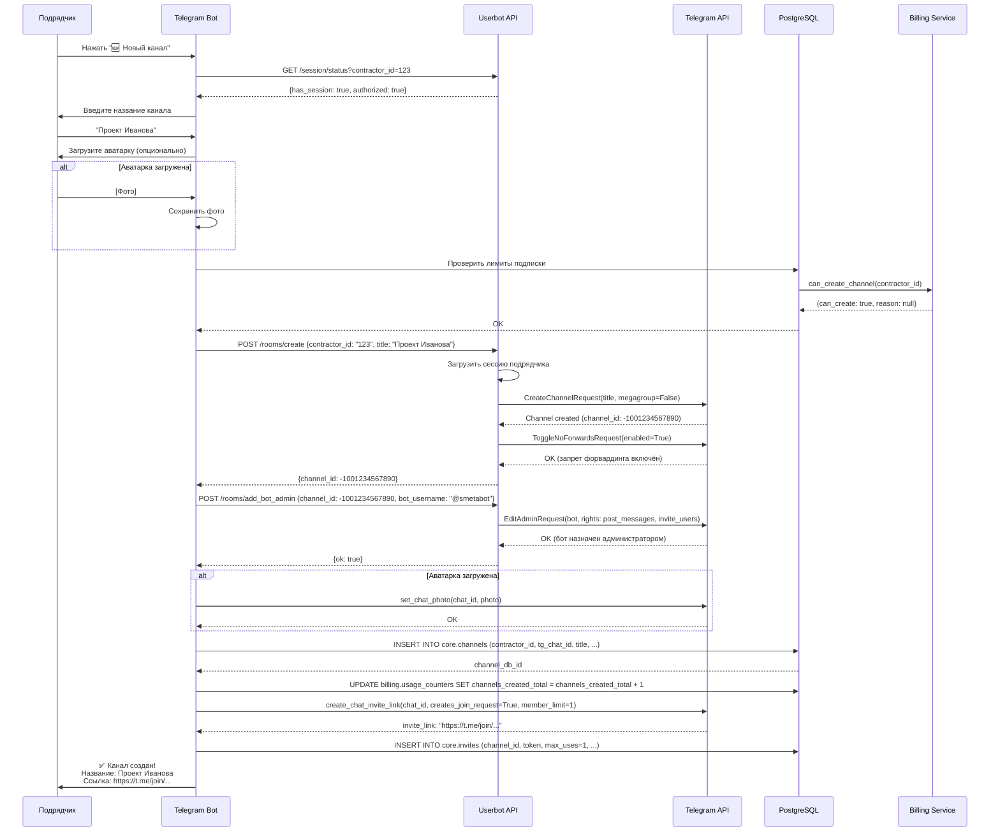

### 4.2. Блок-схема процесса

```mermaid
flowchart TD
    Start([Пользователь: "Новый канал"]) --> CheckSession{Сессия<br/>авторизована?}
    
    CheckSession -->|Нет| RequestAuth[Запросить авторизацию]
    CheckSession -->|Да| InputTitle[Ввести название канала]
    
    InputTitle --> OptionalAvatar{Загрузить<br/>аватарку?}
    OptionalAvatar -->|Да| UploadAvatar[Загрузить фото]
    OptionalAvatar -->|Нет| CheckLimits
    UploadAvatar --> CheckLimits
    
    CheckLimits{Проверить<br/>лимиты подписки} -->|Превышен| ShowError[Ошибка: лимит превышен]
    CheckLimits -->|OK| CreateChannel[POST /rooms/create]
    
    CreateChannel --> EnableNoForwards[Включить ToggleNoForwardsRequest]
    EnableNoForwards --> AddBotAdmin[POST /rooms/add_bot_admin]
    
    AddBotAdmin --> SetAvatar{Аватарка<br/>есть?}
    SetAvatar -->|Да| SetPhoto[Установить фото канала]
    SetAvatar -->|Нет| SaveToDB
    SetPhoto --> SaveToDB
    
    SaveToDB[Сохранить в core.channels] --> IncrementCounter[Инкремент счётчика каналов]
    IncrementCounter --> CreateInvite[Создать одноразовую ссылку]
    CreateInvite --> SaveInvite[Сохранить в core.invites]
    SaveInvite --> ShowSuccess[Показать результат пользователю]
    
    ShowError --> End([Конец])
    ShowSuccess --> End
    
    style Start fill:#90EE90
    style End fill:#FFB6C1
    style CreateChannel fill:#87CEEB
    style ShowSuccess fill:#DDA0DD
```

---

## 5. Сценарий: Публикация документа

### 5.1. Полный процесс обработки

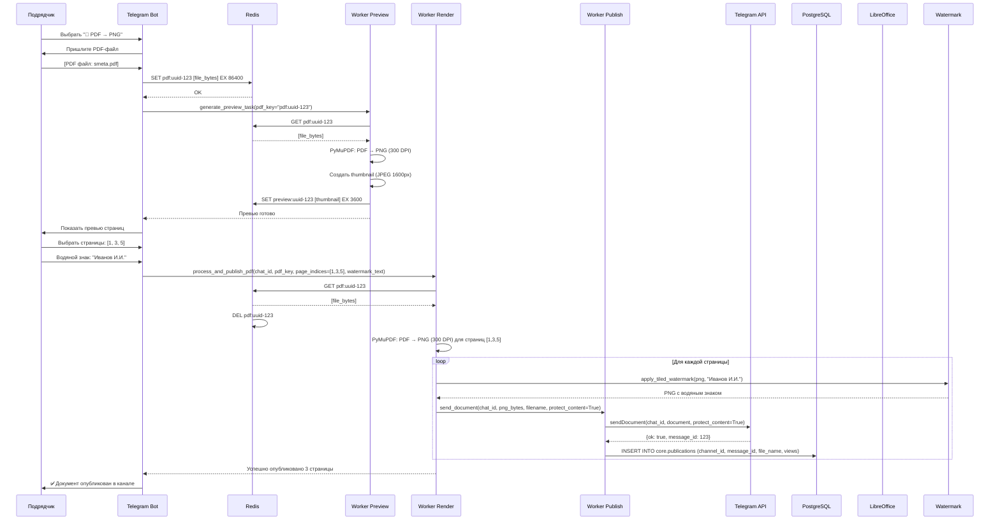

### 5.2. Схема обработки разных форматов

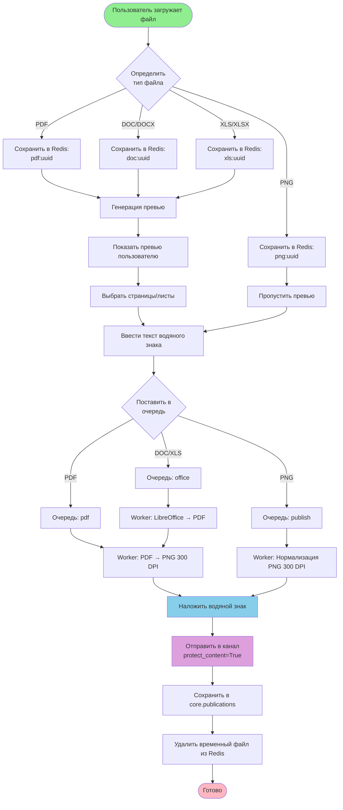

### 5.3. Детальная схема рендеринга

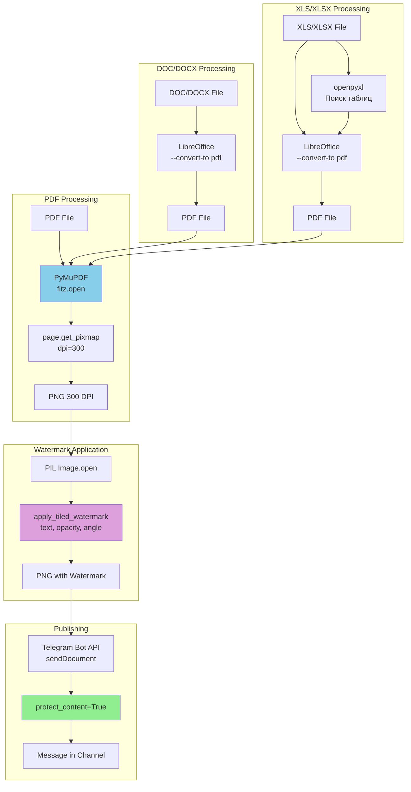

---

## 6. Сценарий: Клиент получает доступ

### 6.1. Диаграмма последовательности

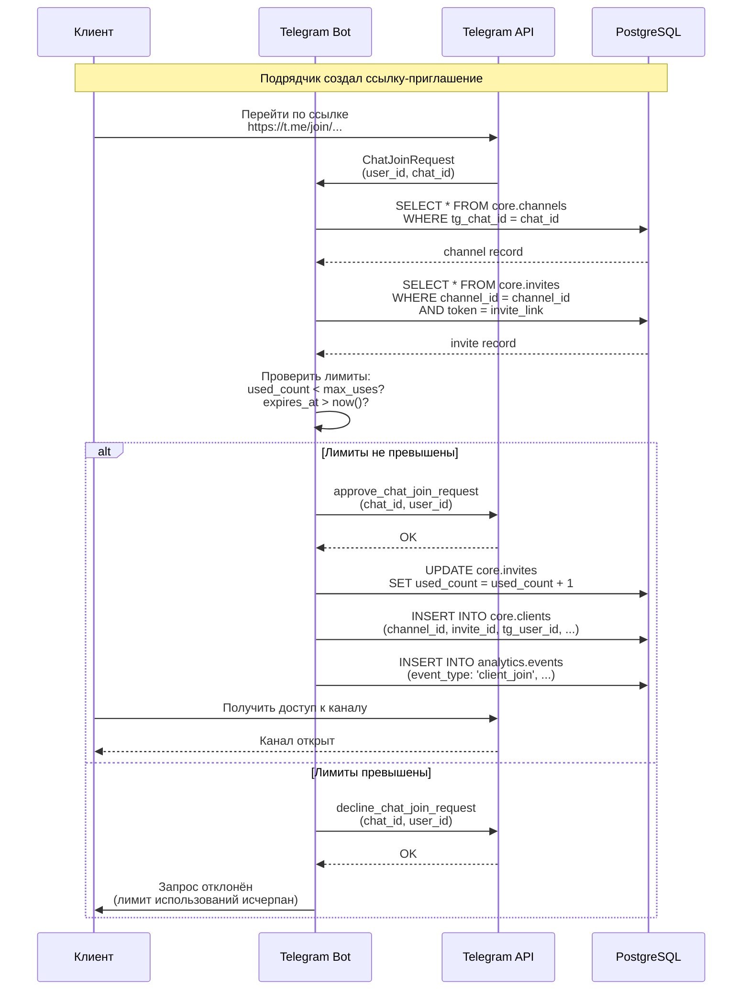

### 6.2. Блок-схема процесса

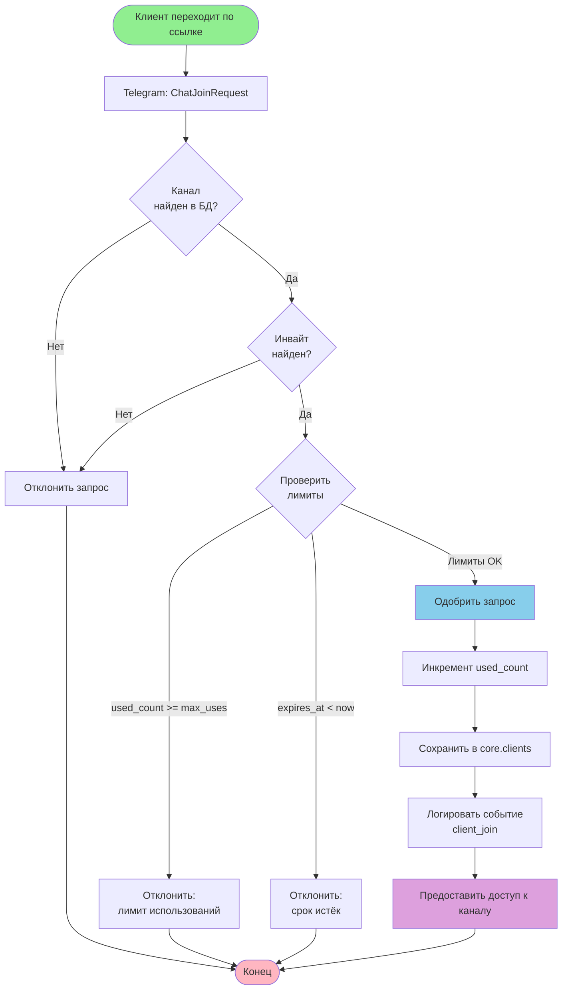

---

## 7. Поток данных: Обработка документа

### 7.1. Полный поток данных

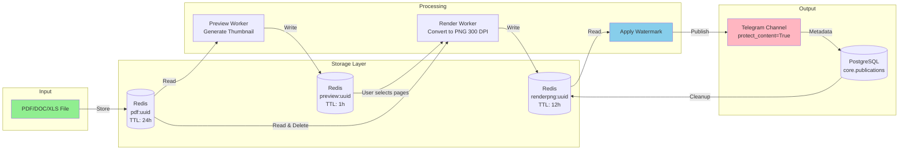

### 7.2. Схема очередей Celery

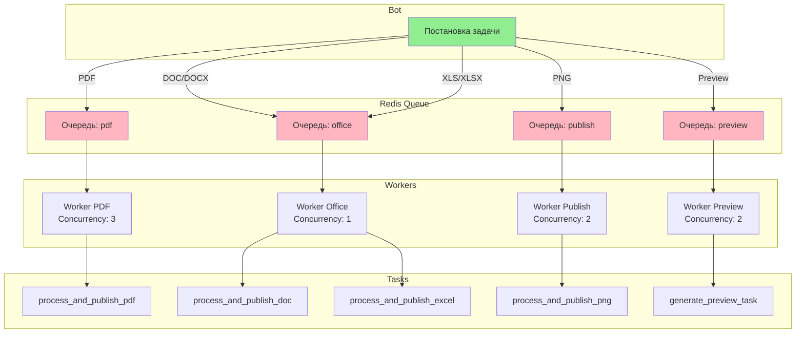

---

## 8. Схема базы данных

### 8.1. ER-диаграмма основных сущностей

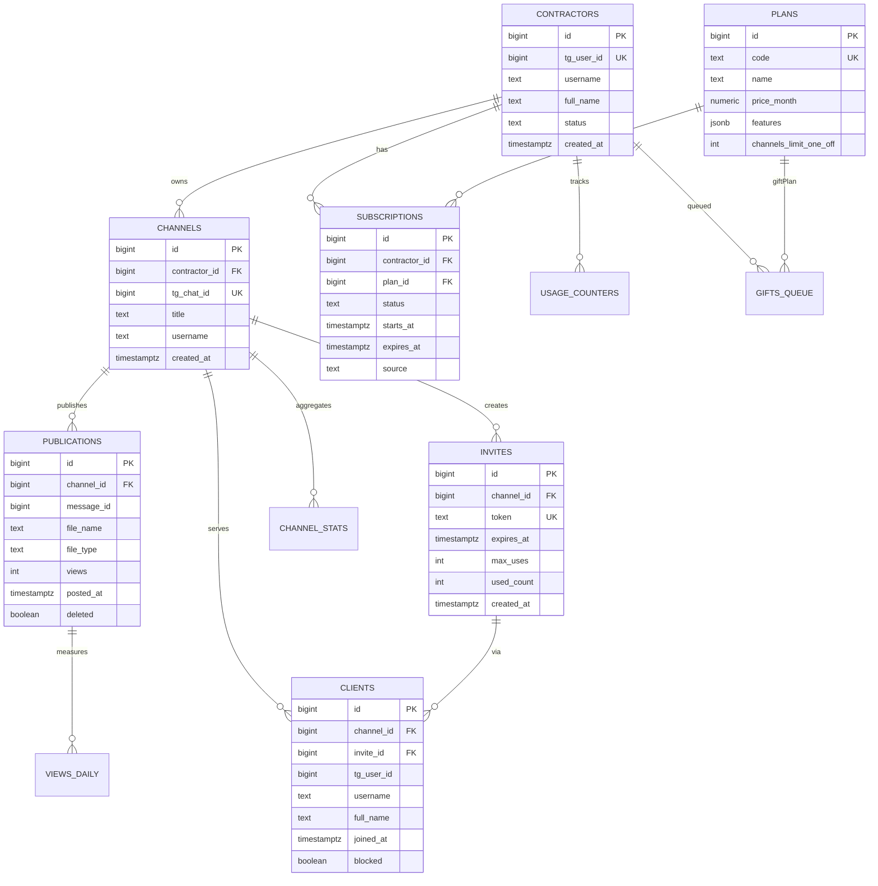

### 8.2. Схема связей между таблицами

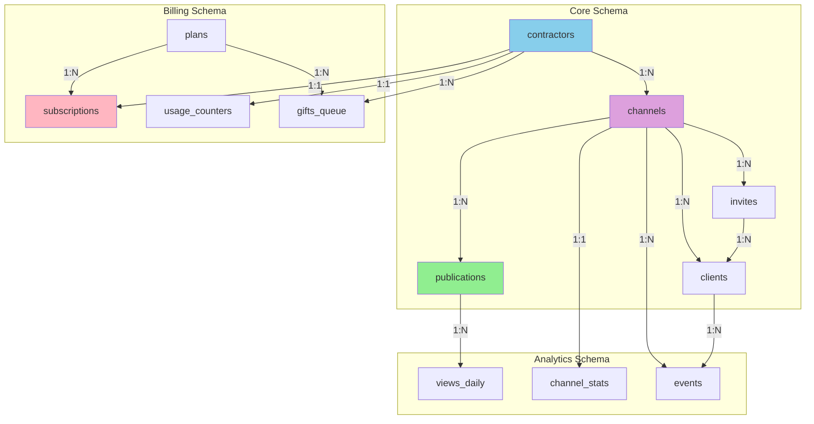

---

## 9. Инфраструктура развёртывания

### 9.1. Docker Compose архитектура

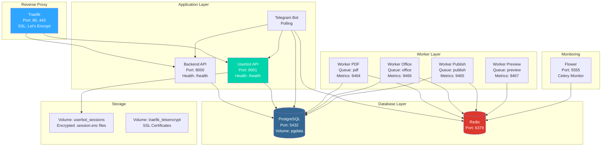

### 9.2. Схема сетей

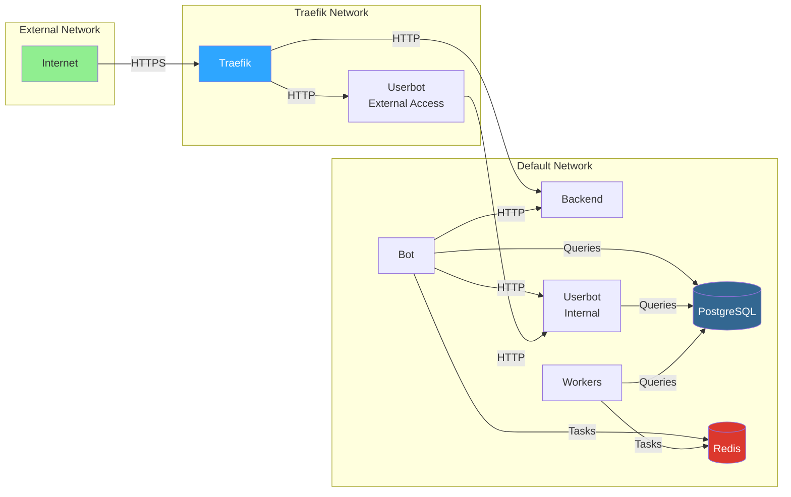

---

## 10. Схема взаимодействия компонентов

### 10.1. Полный цикл: от загрузки до публикации

```mermaid
sequenceDiagram
    participant U as Подрядчик
    participant B as Bot
    participant R as Redis
    participant WP as Worker Preview
    participant WR as Worker Render
    participant WPUB as Worker Publish
    participant T as Telegram API
    participant DB as PostgreSQL

    U->>B: Загрузить PDF
    B->>R: SET pdf:uuid [bytes] EX 86400
    B->>WP: generate_preview_task(pdf_key)
    
    WP->>R: GET pdf:uuid
    R-->>WP: [bytes]
    WP->>WP: PDF → PNG → JPEG (thumbnail)
    WP->>R: SET preview:uuid [thumbnail] EX 3600
    WP-->>B: Превью готово
    
    B->>U: Показать превью, выбрать страницы
    U->>B: Страницы [1,3,5], водяной знак "Иванов"
    
    B->>WR: process_and_publish_pdf(chat_id, pdf_key, pages, watermark)
    WR->>R: GET pdf:uuid
    R-->>WR: [bytes]
    R->>R: DEL pdf:uuid
    
    loop Для каждой страницы
        WR->>WR: PDF → PNG 300 DPI
        WR->>WR: apply_watermark("Иванов")
        WR->>WPUB: send_document(chat_id, png_bytes, protect_content=True)
        WPUB->>T: sendDocument(chat_id, document, protect_content=True)
        T-->>WPUB: {ok: true, message_id: 123}
        WPUB->>DB: INSERT INTO core.publications (channel_id, message_id, file_name, views)
    end
    
    WR-->>B: Успешно опубликовано
    B->>U: ✅ Документ опубликован
```

### 10.2. Схема обработки ошибок и retry

```mermaid
flowchart TD
    Start([Отправка документа]) --> Send[Telegram API: sendDocument]
    
    Send --> CheckResult{Результат}
    
    CheckResult -->|ok: true| Success[Успех]
    CheckResult -->|Error 403| Retry403{Retry<br/>403?}
    CheckResult -->|Error 429| Retry429[FloodWait<br/>Подождать N секунд]
    CheckResult -->|Error 400| LogError[Логировать ошибку]
    CheckResult -->|Network Error| RetryNetwork[Retry через 5 сек]
    
    Retry403 -->|Да| Wait403[Подождать 10 сек]
    Wait403 --> Send
    Retry403 -->|Нет| LogError
    
    Retry429 --> Wait429[Подождать N секунд]
    Wait429 --> Send
    
    RetryNetwork --> CheckRetries{Попыток<br/>< 3?}
    CheckRetries -->|Да| Send
    CheckRetries -->|Нет| LogError
    
    Success --> SaveDB[Сохранить в БД]
    SaveDB --> End([Готово])
    
    LogError --> End
    
    style Start fill:#90EE90
    style End fill:#FFB6C1
    style Success fill:#87CEEB
    style LogError fill:#FF6B6B
```

---

## Примечания

### Условные обозначения

- **Зелёный** — начало процесса
- **Розовый** — конец процесса
- **Голубой** — важные операции
- **Фиолетовый** — успешное завершение
- **Красный** — ошибки

### Технические детали

1. **QR-код авторизация**: Использует `client.qr_login()` из Telethon, который генерирует QR-код для сканирования в Telegram Desktop/Web
2. **Шифрование сессий**: Fernet с ключом из `SESSION_SECRET`
3. **TTL в Redis**: 
   - Исходные файлы: 24 часа
   - Превью: 1 час
   - Полные PNG: 12 часов
4. **Защита контента**: Все публикации с `protect_content=True` и `ToggleNoForwardsRequest`

---

**Версия документа:** 1.0  
**Дата создания:** 2024  
**Последнее обновление:** 2024

